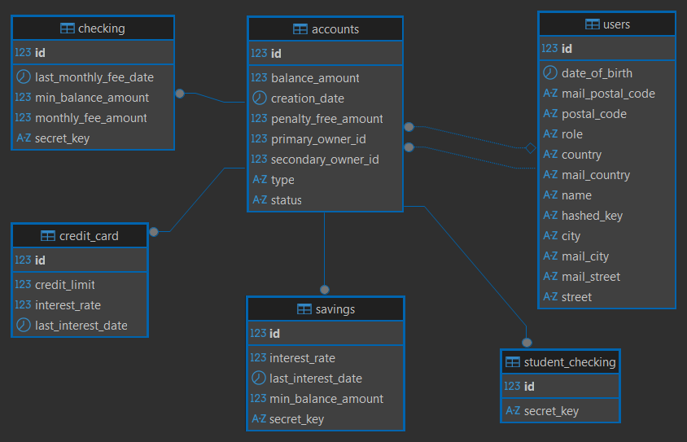

# BankBack

## Descripción del Proyecto

**BankBack** es una aplicación web backend basada en Spring Boot que simula un sistema bancario.

Permite la gestión de cuentas bancarias, usuarios y operaciones básicas como consultas, transferencias, creación de cuentas por parte del administrador y movimientos de terceros. El sistema implementa reglas de negocio como mínimos, comisiones, intereses y penalizaciones.


## Diagrama de Clases



> Este diagrama se generó con la herramienta de visualización de DBeaver y refleja las relaciones entre entidades.


## Configuración del Proyecto
```bash

# 1) Clonar repositorio
     git clone https://github.com/iamluismoran/bankBack.git

# 2) Crear base de datos MySQL (nombre: bankback)
     Se recomienda MySQL 8+ (funciona con 5.7, pero con advertencia)

# 3) Configurar las credenciales de la base de datos

# 4) Ejecuta la applicación
     ./mvnw spring-boot:run
          
# Luego edita usuario/contraseña/puerto si es necesario

```
### Requisitos previos:
- JDK 17 o superior
- Maven (o wrapper)
- MySQL (local)
- Postman (opcional, para pruebas de API)


## Tecnologías utilizadas

- Java 17, Spring Boot 3.5.5
- Maven
- Spring Data JPA / Hibernate
- MySQL
- Lombok
- DBeaver
- Postman
- IntelliJ IDEA
- JUnit 5
- GitHub


## Estructura de controladores y rutas


| Controller                | Body / Params         | Description                                                                                           |
|---------------------------|-----------------------|-------------------------------------------------------------------------------------------------------|
| `AccountsController`      | `/api/accounts`       | Consultar balance(aplica intereses) y trasnnferencias entre cuentasc con validaciones                 |
| `AdminAccountsController` | `/api/admin/accounts` | Alta de cuentas (Chechking/Student, Savings, CreditCard), cambio de estado (ACTIVE/FROZEN) y borrado. |
| `ThirdPartyController`    | `/api/third-party`    | Movimiento de terceros usando hashed key en header + `accountId` y `secretKey`    |


> Todas las rutas aceptan/devuelven JSON


## Enlaces adicionales
- [Presentación del proyecto]()


## Trabajo futuro
- Detección de fraude (patrones 24h) y ráfagas <1s)
- Autenticación y autorización (Spring Security)
- Tarreas prgramadas para mantenimiento mensual


## Recursos
- Spring Boot Docs
- Spring Data JPA - Hibernate
- MySQL Docs
- Postman Learning Center


## Autor del Proyecto
- Autor: Luis Elías Morán
- GitHub: [iamluismoran](https://github.com/iamluismoran)


## 🧩 Arquitectura del Proyecto

El sistema se organiza en las siguientes clases y paquetes:

- `Book`: Representa un libro con ISBN, título, categoría y cantidad disponible.
- `Author`: Representa al autor de un libro (relación uno a uno).
- `Student`: Representa a un estudiante con su USN (número de estudiante) y nombre.
- `Issue`: Registra un préstamo de libro, incluyendo fechas y referencias al estudiante y libro involucrados.
- **Repositorios**: Clases como `BookRepository`, `IssueRepository`, etc., se encargan de la persistencia de datos en archivos CSV.
- **Pruebas**: Tests unitarios realizados con JUnit 5 para asegurar la correcta funcionalidad del sistema.


